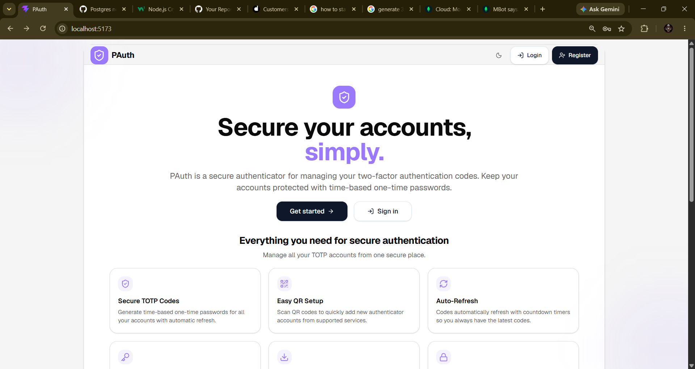

# PAuth — Secure Authenticator App

PAuth is a full-stack authenticator application built with MongoDB, Express.js, React, and Node.js. It helps users manage their authenticator accounts, generate time-based one-time passwords (TOTP), and securely back up and restore their accounts.

## Screenshots

### Landing Page



### Dashboard


### Add Account / QR Code


### Recovery Codes


## Features

### Authentication
- User registration and login
- JWT-based authentication
- Password hashing with bcrypt
- Protected API routes

### Authenticator Management
- Create, view, edit, and delete authenticator accounts
- Generate and verify TOTP codes
- QR-code support for authenticator setup
- Live OTP countdown timers
- SHA1, SHA256, and SHA512 algorithm support
- Six-digit and eight-digit OTP support
- Configurable OTP periods
- Search and account management
- Recovery codes for account recovery

### Backup and Restore
- Export authenticator accounts into an encrypted backup
- Import accounts from a backup
- Skip accounts that already exist for the user
- Generate fresh recovery codes for imported accounts

### Security
- AES-256-GCM encryption for stored authenticator secrets
- bcrypt password hashing
- Input validation with Zod
- Rate limiting
- Restricted CORS configuration
- Security headers using Helmet
- Environment-based configuration

### User Interface
- Responsive React interface
- Dark mode
- OTP countdown display
- Account management dialogs

## Tech Stack

**Frontend**
- React
- Vite
- React Router
- Axios
- Tailwind CSS

**Backend**
- Node.js
- Express.js
- MongoDB and Mongoose
- JWT
- bcrypt
- Zod
- Helmet
- otpauth
- QR-code generation

## Project Structure

```text
auth-app/
├── backend/
│   ├── src/
│   │   ├── config/
│   │   ├── controllers/
│   │   ├── db/
│   │   ├── middleware/
│   │   ├── models/
│   │   ├── routes/
│   │   ├── utils/
│   │   └── validations/
│   ├── .env.example
│   ├── package.json
│   └── server.js
├── frontend/
│   ├── src/
│   │   ├── components/
│   │   ├── pages/
│   │   ├── services/
│   │   ├── validations/
│   │   └── ...
│   ├── .env.example
│   ├── package.json
│   └── vite.config.js
├── docs/
│   └── screenshots/
│       ├── image-1.png
│       ├── image-2.png
│       ├── image-3.png
│       └── image.png
├── .gitignore
└── README.md
```

## Prerequisites

Install the following before running PAuth locally:

- Node.js LTS and npm
- Git
- MongoDB locally, or a MongoDB Atlas cluster

## Getting Started

### 1. Clone the repository

```bash
git clone https://github.com/aditya-044/pauth.git
cd pauth
```

### 2. Configure the backend

```bash
cd backend
npm install
```

Create a `.env` file from `.env.example`.

**Windows PowerShell:**

```powershell
Copy-Item .env.example .env
```

**Git Bash / macOS / Linux:**

```bash
cp .env.example .env
```

Configure your backend environment variables:

```env
PORT=5001
NODE_ENV=development

FRONTEND_URL=http://localhost:5173
MONGODB_URI=mongodb://localhost:27017/authenticator-app

JWT_SECRET=replace-with-a-strong-random-secret
JWT_EXPIRE=7d

ENCRYPTION_KEY=replace-with-exactly-32-characters

RATE_LIMIT_WINDOW_MS=900000
RATE_LIMIT_MAX_REQUESTS=100
```

Replace the placeholder values with appropriate local configuration. The encryption key must contain exactly 32 characters for this project's encryption implementation.

If you use MongoDB Atlas, replace `MONGODB_URI` with your Atlas connection string.

**Never commit real credentials, `.env` files, JWT secrets, or encryption keys.**

### 3. Start the backend

From the `backend` directory, run:

```bash
npm run dev
```

Use the start command defined in `backend/package.json` if a development script is not available.

The backend is expected to run at:

```text
http://localhost:5001
```

Health endpoint:

```text
http://localhost:5001/api/health
```

### 4. Configure the frontend

Open a second terminal in the project root:

```bash
cd frontend
npm install
```

Create `frontend/.env` with:

```env
VITE_API_URL=http://localhost:5001/api
```

The frontend API URL must point to the backend API.

### 5. Start the frontend

From the `frontend` directory, run:

```bash
npm run dev
```

Open the local URL printed by Vite, usually:

```text
http://localhost:5173
```

Register an account and sign in to start using PAuth.

## Using PAuth

1. Register and log in.
2. Add an authenticator account using the required account details and TOTP secret.
3. View generated OTPs and their countdown timers.
4. Use the verification feature to check an OTP.
5. Save newly generated recovery codes securely when displayed.
6. Export an encrypted backup when needed.
7. Import a backup to restore accounts. Existing accounts are skipped rather than duplicated.

**Important:** Authenticator secrets, recovery codes, and backup files are sensitive credentials. Keep them private and store backups securely.

## Environment Variables

| Variable | Purpose |
|---|---|
| `PORT` | Backend server port |
| `NODE_ENV` | Application environment |
| `FRONTEND_URL` | Allowed frontend origin for CORS |
| `MONGODB_URI` | MongoDB connection string |
| `JWT_SECRET` | Secret used to sign JWTs |
| `JWT_EXPIRE` | JWT expiration period |
| `ENCRYPTION_KEY` | Key used to encrypt authenticator secrets |
| `RATE_LIMIT_WINDOW_MS` | Rate-limit time window |
| `RATE_LIMIT_MAX_REQUESTS` | Maximum requests in the configured window |
| `VITE_API_URL` | Frontend API base URL |

Only frontend variables prefixed with `VITE_` should be considered browser-visible. Never put backend secrets in frontend environment variables.

## API Overview

The API base path is `/api`.

### Authentication

| Method | Endpoint | Purpose |
|---|---|---|
| POST | `/auth/register` | Register a user |
| POST | `/auth/login` | Log in |
| GET | `/auth/me` | Retrieve the authenticated user |

### Authenticator Accounts

| Method | Endpoint | Purpose |
|---|---|---|
| POST | `/accounts` | Create an account |
| GET | `/accounts` | List the user's accounts |
| GET | `/accounts/codes` | Retrieve account codes |
| GET | `/accounts/:id` | Retrieve one account |
| PUT | `/accounts/:id` | Update an account |
| DELETE | `/accounts/:id` | Delete an account |
| POST | `/accounts/:id/verify` | Verify an OTP |
| POST | `/accounts/:id/recovery` | Verify a recovery code |
| GET | `/accounts/:id/qrcode` | Retrieve a QR code |

Account endpoints require authentication unless explicitly documented otherwise.

### Backup

| Method | Endpoint | Purpose |
|---|---|---|
| GET | `/backup/export` | Export an encrypted backup |
| POST | `/backup/import` | Import an encrypted backup |

### Health

| Method | Endpoint | Purpose |
|---|---|---|
| GET | `/api/health` | Check backend availability |

## Deployment

The planned deployment architecture is:

- **Frontend:** Vercel
- **Backend:** Render
- **Database:** MongoDB Atlas

Production deployment requires the appropriate environment variables, database access, frontend origin, and HTTPS configuration.

## Contributing

Contributions are welcome.

1. Fork the repository.
2. Create a feature branch.
3. Make focused changes.
4. Test your changes.
5. Open a pull request describing your changes.

## License

ISC

## Disclaimer

PAuth is an educational software project. Review its security and operational behavior carefully before relying on it for important authentication credentials.
